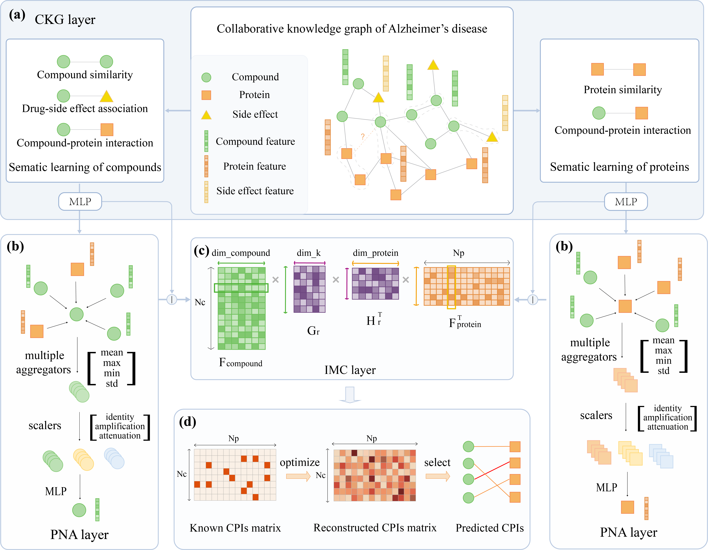

# CKG-IMC: an inductive matrix completion method enhanced by collaborative knowledge graph and graph neural network for Alzheimer’s disease compound-protein interactions prediction
## Introduction
Alzheimer’s disease (AD) is a prevalent neurodegenerative disorder without effective therapeutic interventions. To address this challenge, we present CKG-IMC, a deep learning model for predicting compound-protein interactions (CPIs) relevant to AD. CKG-IMC integrates three modules: a Collaborative Knowledge Graph (CKG), a Principal Neighborhood Aggregation Graph Neural Network (PNA), and an Inductive Matrix Completion (IMC).



## Environment Requirement
The code has been tested running under Python 3.8 and 3.9.18. The required packages are as follows:
```
numpy>=1.25.0
pandas>=2.0.3
scikit-learn>=1.3.0
torch>=2.0.1
torch_geometric>=2.3.1
tqdm>=4.65.0
```
## Usage
To perform 10-fold cross-validation, run the following command:
```bash
python main.py -adv
```

For predicting compound-protein interactions (CPIs), use the following command:
```bash
python main.py -adv --do_predict
```
For displays the help message, use the following command:
```bash
python main.py -h
```
## Data
Please see the [README](./data/README.md) for detailed explanation.
This study aims to predict CPIs for Alzheimer’s disease. To achieve this, we integrate six widely utilized public databases, including CTD, UniProt, PubChem, SIDER, DrugBank and ChemSpider, along with four commonly employed DTI datasets (namely Luo’s dataset, Hetionet, Yamanishi_08, and BioKG) to acquire information concerning compounds, drug side effects, and proteins relevant to Alzheimer’s disease.

Here are the data explanation of files under `./data` folder.
### Relationship files
1. **CCS.npy**
   - *Format:* NumPy Binary file
   - *Purpose:* Represents Compound-Compound Similarity matrix.
   - *Size:* 8360 rows x 8360 cols 
   - *Description:* The CCS.npy file is a NumPy binary file storing the Compound-Compound Similarity matrix with dimensions 8360 x 8360, where each element represents the similarity between compounds. The values in the matrix fall within the range of 0 to 1, providing a normalized measure of similarity. A value closer to 1 indicates a higher similarity, while a value closer to 0 suggests dissimilarity.
2. **PPS.npy**
   - *Format:* Binary file
   - *Purpose:* Represents the Protein-Protein Similarity matrix.
   - *Size:* 1975 rows x 1975 cols 
   - *Description:* The PPS.npy file is a NumPy binary file storing the Protein-Protein Similarity matrix with dimensions 1975 x 1975, where each element represents the similarity between proteins. The values in the matrix fall within the range of 0 to 1, providing a normalized measure of similarity. A value closer to 1 indicates a higher similarity, while a value closer to 0 suggests dissimilarity.
3. **CPI.npy**
   - *Format:* Numpy Binary file
   - *Purpose:* Represents the Compound-Protein Interaction matrix.
   - *Size:* 8360 rows x 1975 cols
   - *Description:* Each element in the matrix is either 0 or 1, indicating the absence or presence of the interaction relationship.
4. **compound_se.npy**
   - *Format:* NumPy Binary file
   - *Purpose:* Represents drug-side effect relationships matrix.
   - *Size:* 8360 rows x 5854 cols
   - *Description:* Each element in the matrix is either 0 or 1, indicating the absence or presence of the drug-side effect relationship.


### Train and test folds file
1. **CPI_with_negative_sample.csv**
   - *Format:* CSV file
   - *Size:* 1,875,504 rows x 3 cols
   - *Purpose:* Contains compound-protein interaction information with negative samples.
   - *Description:* Each row represents a compound-protein interaction. The columns are as follows:
      - `compound_idx`: Index representing the compound.
      - `protein_idx`: Index representing the protein.
      - `label`: Binary label indicating the interaction (1) or a negative sample (0).
### Entity files
1. **compounds.list**
   - *Format:* Text file
   - *Purpose:* Contains a list of compound CIDs.
   - *Size:* 8360 rows
   - *Description:* Each row represents the CID of a compound from the PubChem database.

2. **proteins.list**
   - *Format:* Text file
   - *Purpose:* Contains a list of protein IDs.
   - *Size:* 1975 rows
   - *Description:* Each row represents the UID of a protein from the UniProt database.

3. **se.list**
    - *Format:* Text file
    - *Purpose:* Contains a list of side-effect IDs.
    - *Size:* 5854 rows
    - *Description:* Each row represents the ID of a side effect from the SIDER database.

4. **entities.dict**
   - *Format:* Text file
   - *Purpose:* Contains a dictionary mapping entity row numbers to their IDs in database.
   - *Description:* The first column represents entity's row numbers, and the second column represents their IDs in corresponding database . The content typically follows the order of compounds, proteins, and side effects. The first column and the second column are separated by tabs. 

5. **relations.dict**
   - *Format:* Text file
   - *Purpose:* Contains a dictionary mapping relation names to IDs.
   - *Size:* 4 rows x 2 cols
   - *Description:* The relations.dict file serves as a mapping between relation names and their corresponding IDs. The first column represents the relation IDs, and the second column represents the corresponding relation name. The first column and the second column are separated by tabs.  
## Citation
If you find this work useful, please consider citing our paper.

